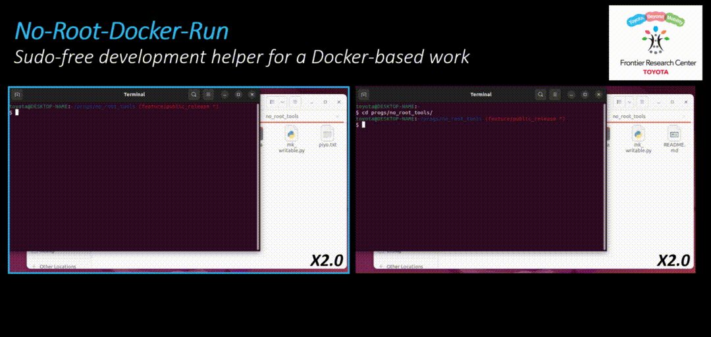

# NO-ROOT-DOCKER-RUN

<a href="https://global.toyota/en/mobility/frontier-research/" target="_blank">
 
</a>

[Overview](#Overview) | [Installation](#installation) | [Usage](#usage) | [Tutorial](#tutorial) | [License](#license)

**NO-ROOT-DOCKER-RUN** is a repository containing scripts that support Docker-based software development used by the TOYOTA Frontier Research Center robotics research group.
Our goal is to provide an easy-to-use reproduction of our study results and facilitate further research.
Although this package works as a standalone library, this design is particularly intended for [TRI-VIDAR](https://github.com/TRI-ML/vidar) and [SGInit-VO](https://github.com/Toyota/SGInit-VO), where the Makefile-and-docker builds the environmental setup.

Please note that we cannot guarantee future monitoring and official support while we strive to provide assistance or maintenance. 


## Overview

<p align="center">
  
</p>

Given the pre-built docker image, the scripts provide **a root-independent wrapper image** and **its run's configurations** by:

- Create a new user `${USER}`, sharing the same `group/user ID` of the localhost.
- Make a directory that is editable and shareable with a localhost.

## Installation

### Makefile
Assuming the Makefile style of [TRI-Ml/PackNet-SfM](https://github.com/TRI-ML/packnet-sfm), add the following new commands to your Makefile:


```Makefile
# Mount destination dir (call -v) to save the log file, weight, etc.
DOCKER_OPTS := -v ${CKPT_MNT}:/data/checkpoints \
            :
# Set a proper path to this repository
PATH2NRT ?= ${PWD}

# %%%%%%%%%%%%%%%%%%%%%%%%%%%%%%%%%%%%%%%%%%%%%%%%%%%%
# ---------- FRC NO-ROOT-TOOLS COMMAND PART ----------
initialize-scripts:
	python3 ${PATH2NRT}/run_setup.py ${DOCKER_IMAGE}

mkdir-writable:
	python3 ${PATH2NRT}/mk_writable.py --dirs ${CKPT_MNT}

noroot-build: docker-build initialize-scripts
	docker build \
		-f ${PATH2NRT}/dist/Dockerfile.no_root \
		-t ${DOCKER_IMAGE}-${USER} .

noroot-interactive: mkdir-writable
	docker run --gpus all ${DOCKER_OPTS} \
    --name ${PROJECT}-${USER} ${DOCKER_IMAGE}-${USER} bash
# ----------------------------------------------------
# %%%%%%%%%%%%%%%%%%%%%%%%%%%%%%%%%%%%%%%%%%%%%%%%%%%%
```

For a complete example, please refer to [this Makefile](Makefile), or that of [SGInit-VO](https://github.com/Toyota/SGInit-VO/blob/main/Makefile): where this NO-ROOT-TOOLS is integrated as the *git submodule* and associated with the PATH2NRT configuration, i.e. `PATH2NRT ?= thirdparty/no_root_docker_run`.

### Commands
- `initialize-scripts`: Create docker builder scripts, including host information (username, uid, gid) from templates at `src`.

- `mkdir-writable`: Create user-editable directories to be mounted into a docker container.

- `noroot-build`: Build a root-independent wrapper image from the pre-build image.

- `noroot-interactive`: Enter the container as the non-root user who shares all the permission with the local host.


## Usage
Once the target docker image intended for **root**-user is built, build the "wrapper" version based on it that has another username by:

```bash
make noroot-build
```

Then 
```bash
make noroot-interactive
```

## Tutorial
We provide a tutorial for your development, demonstrating that:

- **Build non-root wrapper image**, `nrtdemo:latest-${YOUR-USERNAME}` from `nrtdemo:latest` (Please refer to [Dockerfile](docker/Dockerfile) and [Makefile](Makefile))

- **Configuration for permission-stress-free read/write**, assuming log files are generated at your Host's `~/nrt-demo/nrtdemo/checkpoints`.

- **Coexistence with `tmux`**, by allowing the created user to edit the `~/.tmux` of localhost.

Hence, please try the command (described in the [Usage](#usage)) to provide the actual behavior. 

## License

This repository is released under the [MIT](LICENSE) license.